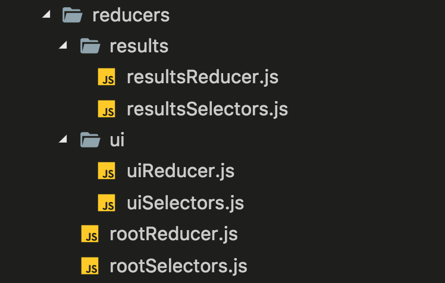

# Selectors proposal

`npm i & npm start`

The goal of this small prototype is to create a proposal set of guidelines and best practices when designing and writing Redux selectors.

# Proposed guidelines

-   [Files and Folder Structure](#Files-and-Folder-Structure)
-   [Selectors State](#Selectors-State)
-   [Selectors with Props](#Selectors-with-Props)
-   [Selectors default values](#Selectors-default-values)
-   [Selector Computing Derived Data](#Selector-Computing-Derived-Data)
-   [Selector Computing Derived Data with Props](#Selector-Computing-Derived-Data-with-Props)

<a name="Files-and-Folder-Structure"></a>

## Files and Folder Structure

Every Reducer file must have an equivalent Selector file.

Selectors must be found inside Reducers folder.



<a name="Selectors-State"></a>

## Selectors State

Every Selector must receive the entire state.

It is Selector responsibility to retrieve its own context (e.g. using upper level selector).

```javascript
import { get } from 'lodash';
import { getUi } from '../rootSelectors';

export const getColor = state => get(getUi(state), 'color');
```

<a name="Selectors-with-Props"></a>

## Selectors with Props

Optionally, Selectors may receive props.

If so, selectors must receive after state, an object with all required props (as its second argument),

```javascript
import { getResults } from '../rootSelectors';

export const getResult = (state, { id }) => getResults(state)[id];
```

<a name="Selectors-default-values"></a>

## Selectors default values

Whenever possible, default values should be defined in the application state using Reducers `defaultState`s.

Selectors should not return default values that are not [primitive values](https://developer.mozilla.org/en-US/docs/Web/JavaScript/Data_structures#Data_types).

```javascript
// DO NOT!
export const getResults = state => get(state, 'results', []);
```

If a non primitive default value is required, `defaultProps` should be used instead.

<a name="Selector-Computing-Derived-Data"></a>

## Selector Computing Derived Data

If a Selector is needed to compute derived data from the state, `createSelector` from [React Starter Kit](https://redux-starter-kit.js.org/api/createselector) must be used.

`createSelector` receives a list of Input Selectors and a Result Function.

When a Selector Computing Derived Data is executed, its Input Selectors will always get executed.

Input Selectors output is sent as input to the Result Function.

A shallow compare is executed over Input Selectors outputs and the Result Function will only get executed if one of its inputs change.

Input Selectors must always be Selectors that only access the state or Selectors that compute derived data created with `createSelector`s.

Input Selectors must not be defined inline.

Result Function may be defined inline.

Input Selectors array notation must be preferred over comma separated notation.

Full documentation [here](https://github.com/planttheidea/selectorator#usage)

```javascript
import { uniq } from 'lodash';
import { createSelector } from 'redux-starter-kit';
import { getResults } from '../rootSelectors';

export const getAllGenders = createSelector(
    [getResults],
    results => uniq(results.map(result => result.gender))
);
```

<a name="Selector-Computing-Derived-Data-with-Props"></a>

## Selector Computing Derived Data with Props

If a Selector Computing Derived Data needs Props, they must be passed as Selectors second argument.

`createSelector` will automatically send the Props to the Input Selectors.

If the Result Function needs any Prop to compute derived data, fake Selectors must be created in order to send the props to the Result Function.

Fake Selectors must be defined inline and the Props sent to the Result Function must always be [primitive values](https://developer.mozilla.org/en-US/docs/Web/JavaScript/Data_structures#Data_types).

If a Selector Computing Derived Data needs to receive Props chances are it will be executed with different Prop values. In order to properly use `reselect` memoization a `make...Selector` function must be created that returns a new instance of a Selector created with `createSelector`.

Each Component must create a `makeMapStateToProps` function that creates its own instance of the Selector and returns the `mapToStateProps` function.

Selector:

```javascript
export const makeGetGenderResults = () =>
    createSelector(
        [getResults, (_, { gender }) => gender],
        (results, gender) => results.filter(result => result.gender === gender);
    );
```

Component:

```javascript
const makeMapStateToProps = () => {
    const getGenderResults = makeGetGenderResults();
    return (state, ownProps) => ({
        results: getGenderResults(state, { gender: ownProps.type })
    });
};

export default connect(makeMapStateToProps)(React.Component);
```
